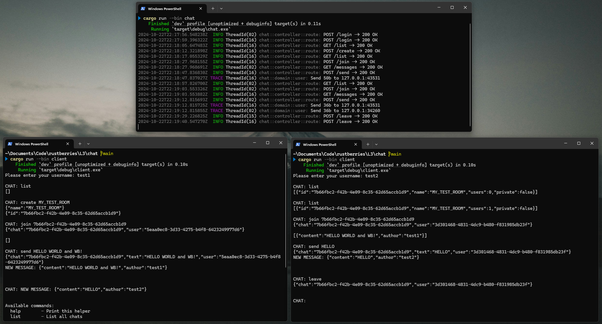

## Мини-проект: L3.3 Реализация многопользовательского онлайн-чата

Реализованы стандартные эндпоинты
- POST /join: присоединение к комнате.
- POST /leave: покидание комнаты.
- POST /send: отправка сообщения в комнату.
- GET /messages: получение сообщений из комнаты.

Реализованы **дополнительные** эндпоинты, для полноценного пользовательского опыта
- POST /login: инициализация пользователя в системе
- POST /create: создание комнаты
- GET /list: список созданных комнат

**Дополнительно** реализован простейший CLI-клиент, для тестирования API и получения сообщений в режиме реального времени (прослушивание сокета)


### Содержание проекта
```
- .env - настройки сервера
- src/
   |
   |- main.rs - запуск сервера
   |
   |- bin/
   |   |
   |   |- client.rs - реализация простого клиента 
   |
   |- controller/ - обработка запросов
   |   |
   |   |- dto.rs - объекты передачи данных
   |   |- route.rs - описание эндпоинтов
   |
   |- domain/ - бизнес логика
   |   |
   |   |- chat.rs - иформация о комнате и broadcast данных
   |   |- user.rs - управляет потоком отправки данных клиенту
   |   |- message.rs - данные
   |
   |- repository/ - хранение данных
   |   |- mod.rs - дополнительно содержит универсальный трейт для контроллеров
   |   |- dashmap.rs - реализация хранения данных в формате DashMap (RwLock<HashMap>)


```

### Пример логов работы сервера и 2ух независимых клиентов
