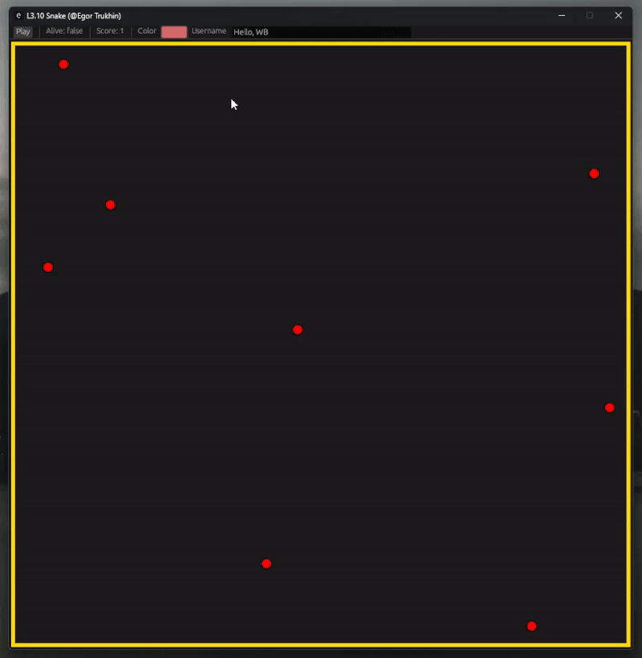
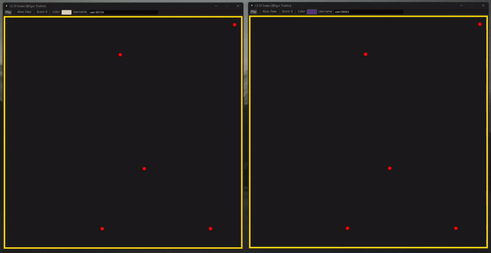

# L3.10 Разработка многопользовательской игры на Rust с использованием сокетов

### Особенности реализации

- Серверно-клиентское приложение 
- Мультиплеерная реализация змейки (цвета, счет, коллизии)
- Отображение состояния игры в режиме реального времени (даже вне игры)
- Приятный графический интерфейс: [egui](https://crates.io/crates/egui) (см. [GIF ниже](#gameplay))
- Собсвенный ассеты, подготовленные в [Figma](https://www.figma.com/)


### Структура проекта

```
|- .env - настройки игры
|
|- assets/ - изображения для отрисовки объектов
|  |
|  |- apple.svg
|  |- snake_head.svg
|  |- snake_body.svg
|
|- src/
   |
   |- lib.rs - библиотечный крейт для доменных объектов
   |- domain/ - базовые компоненты и логика игры
   |   |
   |   |- snake.rs 
   |   |- world.rs
   |   |- apple.rs
   |   |- collider.rs - интерфейсный enum для сравнения позиций объектов
   |
   |- server/ - бинарный крейт
   |   |
   |   |- main.rs 
   |   |- socket.rs - прием входящих подключений, рассылка мира и получение змеек
   |   |- logic.rs - серверная часть логики (например, удаление яблок)
   |
   |- client/ - бинарный крейт
   |   | 
   |   |- main.rs
   |   |- socket.rs - подключение к серверу, получение мира и отправка змейки
   |   |- logic.rs - клиентская часть логики (например, передвижение змейки)

```

### Описание параметров (.env)
```bash
SOCKET_BROADCAST_WORLD="****" # Откуда кленты получают информацию о мире
SOCKET_UPDATE_SNAKE="****" # Куда клиенты отправляют информацию о локальное змейке

# Размеры мира
WORLD_WIDTH=40
WORLD_HEIGHT=40

WORLD_UPDATE_TIME=500 # Частота обновления мира (в мс)
APPLE_SPAWN_TIME=3000 # Частота появления яблок (в мс)
APPLE_SPAWN_LIMIT=30  # Максимальное кол-во яблок в мире
```

## Gameplay 


## Mutliplayer
